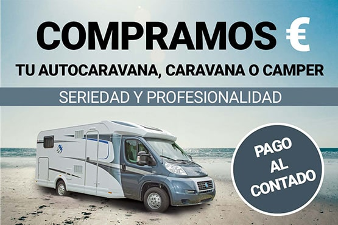
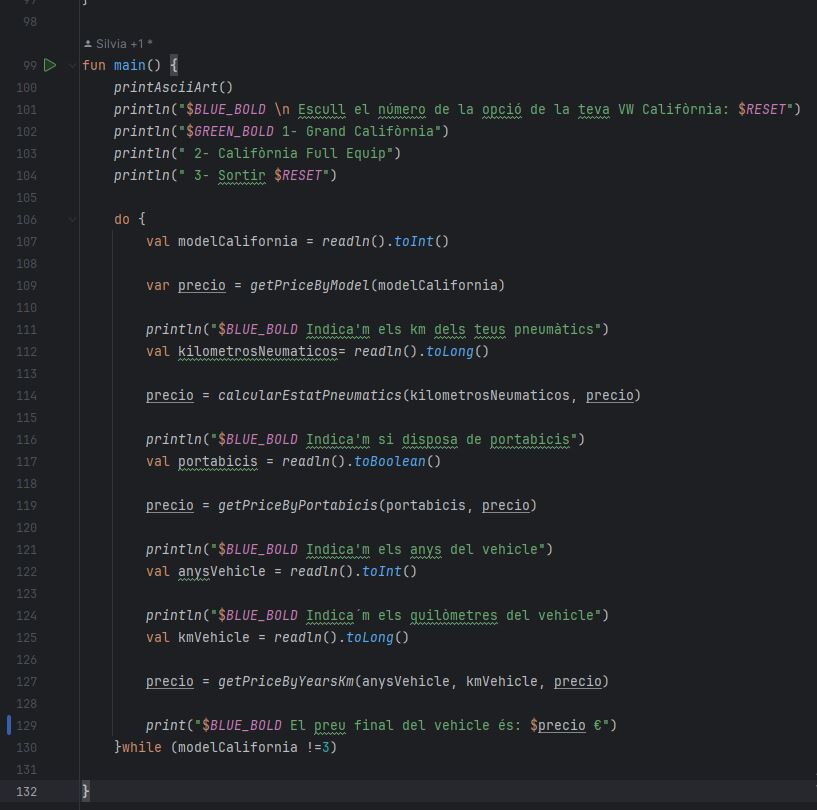
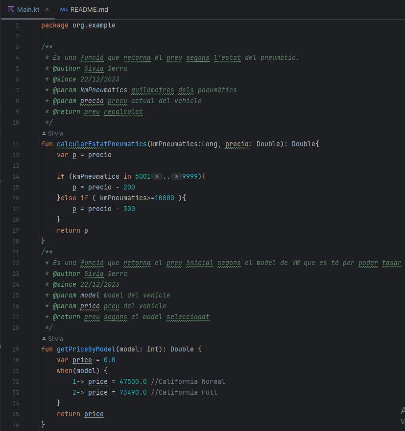
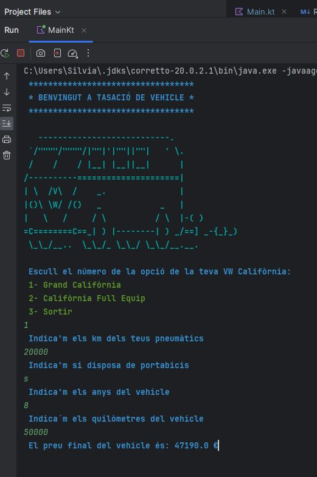
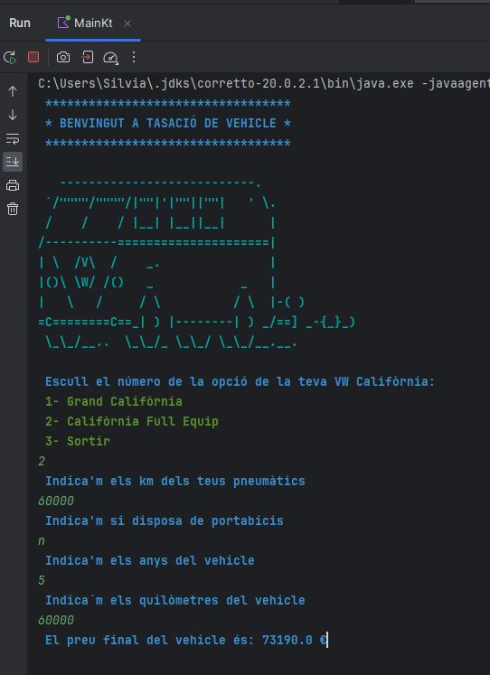

>

# Aplicació per tasar: Volkswagen Grand California
Hem creat una aplicació on l' usuari pot tasar el seu Volkswagen y obtenir el preu
en base a:

* **Els quilòmetres :** El quilometratge fet del vehicle.
* **El model :** El bàsic o el full equip. 
* **L'estat dels pneumàtics :** Saber els quilòmetres fets per saber el desgast.
* **Portabicis equipat :** Si porta portabicis o no.

## Generar documentació Dokka
> .[!TIP].
>  Executa el comando gradlew dokkaHtml des del directori del projecte.
>  Recorda que has de tenir instal·lat el JDK en la teva màquina.

## Imatges de codi

- Funció principal:

>

- Funcions de mostra:

>

- Mostra d'execució del programa:

>
>

### Enllaços

[Llibreria de Raimon Izard](https://github.com/raimonizard/kotlin)

[Crear ascii art](https://www.asciiart.eu/#google_vignette)

[Documentació GitHub](https://docs.github.com/es)